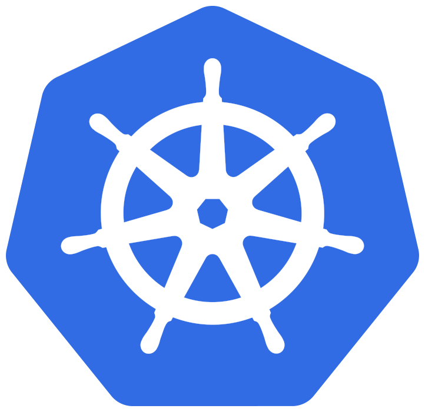

## the different shades of local kubernetes development



Note: test note

<!-- ========== ========== ========== -->

``` shell
$ whoami

name: Tino Stöckel

where                   position
---------------------------------------------------------------
Turbine Kreuzberg GmbH  Platform Engineer
Circus Internet GmbH    Senior Developer / System Operator
Medici Living GmbH      Senior Developer

**skills**
- Kubernetes            - Ansible
- Docker                - JavaScript / Python / Go (working on)

... use -v for verbose

```

<!-- ========== ========== ========== -->

## Abstract
<blockquote style="font-size: .85em; text-align: justify;">
In a world for developer and **cloud native apps** we should not forget about our local **workflows** to keep the **developer** throuhput smooth and in a flow. Since **Kubernetes** gained a lot of traction and is currently right in the center of this debate we shall not miss to grasp a look at its local capabilities, workflows, flaws and it's quirks.
</blockquote>

<!-- ========== ========== ========== -->

## Content
<ul>
    <li>
        
        <span>Kubernetes</span>
    </li>
    <li>(developer) workflow</li>
    <li>local development</li>
</ul>

Note:
- todo: use signs

<!-- ========== ========== ========== -->

## Kubernetes
## but why?

<!-- ========== ========== ========== -->

## Kubernetes
- declarative
- desired state
- kubectl

<!-- ---------- ---------- ---------- -->

### I declare: Hello World!

``` yaml
apiVersion: apps/v1
kind: Deployment
metadata:
  name: nginx-deployment
spec:
  selector:
    matchLabels:
      app: nginx
  replicas: 2 # tells deployment to run 2 pods matching the template
  template:
    metadata:
      labels:
        app: nginx
    spec:
      containers:
      - name: nginx
        image: nginx:1.7.9
        ports:
        - containerPort: 80
```

<!-- ========== ========== ========== -->

## Workflow

<!-- ========== ========== ========== -->

## Actors and Roles
- what kind of roles can an actor fullfill
- what kind of workflow needs an according role?

<!-- ---------- ---------- ---------- -->

## Actor = Developer
- what skills has a developer

Note:
- present fred george model

<!-- ========== ========== ========== -->

### applications of Kubernetes
- Kubernetes for **application developer**
- Kubernetes for **SysOps**
- Kubernetes for **Kubernetes developers**
- ... probably more

Note:
headline: Access to Kubernetes ?

<!-- ========== ========== ========== -->

### what are you doing local?

<!-- ---------- ---------- ---------- -->

### what are you doing local?
#### developer edition

- write some code
- have some sorts of local env
- check if your code works

Note: I assume

<!-- ---------- ---------- ---------- -->

### what are you doing local?
#### SysOp edition

- set up infrastructure
- provision infrastructure
- check if it works

Note: I assume

<!-- ---------- ---------- ---------- -->

### what are you doing local?
#### Kubernetes Developer edition

- set up infrastructure
- provision infrastructure
- check if it works
- write some code
- check if your code works

Note: I assume

<!-- ========== ========== ========== -->
## Tools

- minikube
- kubeadm-dind-cluster
- vagrant

<!-- ========== ========== ========== -->

## minikube
- tool to run Kubernetes locally
- runs a single-node Kubernetes cluster
- alternative: docker-for-desktop edge (OSX/WIN)

<!-- ========== ========== ========== -->

## demo time

<!-- ========== ========== ========== -->

## minikube
#### what it can
- kubectl API
- deployments, services, NodeIP's, 

<!-- ========== ========== ========== -->

## minikube
#### what it can't

- sheduleing across node
    - loose affinity and anti-affinity
- (data) distribution
- node networking ...

<!-- ========== ========== ========== -->

## kubeadm-dind-cluster

<!-- ========== ========== ========== -->

## demo time

<!-- ========== ========== ========== -->

#### what it can
#### what it can't

<!-- ========== ========== ========== -->

## demo time

<!-- ========== ========== ========== -->

#### what it can
#### what it can't
