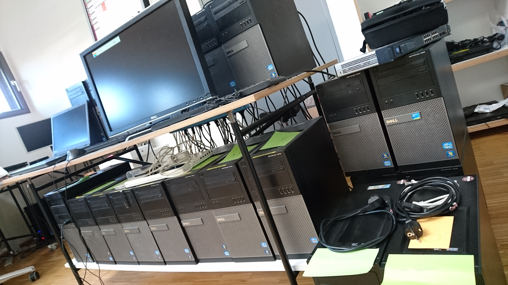
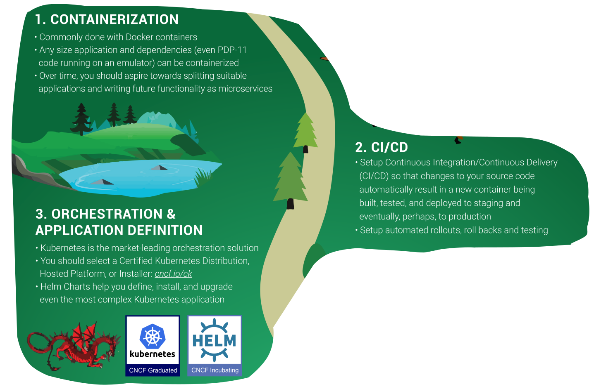
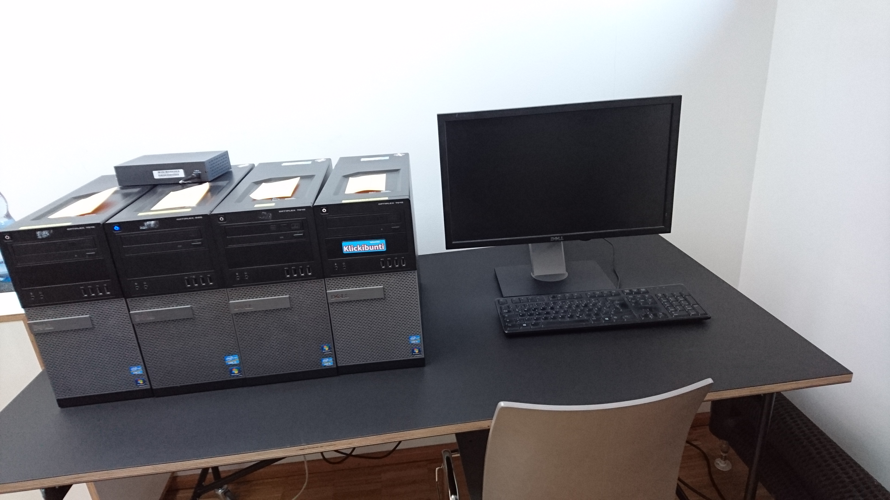

### No one needs a real cluster


### Kubernetes - a local path

Note:
- test note

<!-- ========== ========== ========== -->

``` shell
$ whoami

name: Tino Stöckel

where                   position
---------------------------------------------------------------
Turbine Kreuzberg GmbH  Platform Engineer
Circus Internet GmbH    Senior Developer / System Operator
Medici Living GmbH      Senior Developer

**skills**
- Kubernetes            - Ansible           - Gitlab-CI
- Docker                - JavaScript / Python / Go

... use -v for verbose

```

<!-- ========== ========== ========== -->

### Kubernetes @ 
### Turbine Kreuzberg



<!-- ========== ========== ========== -->

<div style="display: flex; justify-content: space-between; align-items: center;">

    

    <h4
        style="font-size: 1.3em;"
    >
        <span>kubeadm</span>
        <br />
        <span>-dind-</span>
        <br />
        <span>cluster</span>
    </h4>

    

</div>

<!-- ========== ========== ========== -->

## Kubernetes - why
- k8s api
- k8s automatisms
- real scaling & distribution capability

<!-- ========== ========== ========== -->

### Kubernetes - what / how
- infrastructure framework
- declarative
- desired state
- kubectl

<!-- ---------- ---------- ---------- -->

### I declare: Hello World!

``` yaml
apiVersion: apps/v1
kind: Deployment
metadata:
  name: nginx-deployment
spec:
  selector:
    matchLabels:
      app: nginx
  replicas: 2
  template:
    metadata:
      labels:
        app: nginx
    spec:
      containers:
      - name: nginx
        image: nginx:1.7.9
        ports:
        - containerPort: 80
```

<!-- ========== ========== ========== -->

#### CNCF - The Cloud Native Trail Map

<div style="display: flex; justify-content: space-between; align-items: center;">

    

</div>

<!-- ========== ========== ========== -->


### applications of Kubernetes
- **application development**
- **system operations**
- **Kubernetes/Operator development**

<!-- ========== ========== ========== -->

### what are you doing locally?

<!-- ========== ========== ========== -->

### what are you doing locally?
#### application development edition

- write some code
- have some sorts of local env
- check if your code works

Note: I assume

<!-- ========== ========== ========== -->

## minikube
- mainstream tool to run locally
- runs a single-node cluster
- runs in an vm

<!-- ========== ========== ========== -->

## demo time

<!-- ========== ========== ========== -->

### what are you doing local?
#### System Operations edition

- set up infrastructure
- provision infrastructure
- (opt) write some code
- check if it works

Note: I assume

<!-- ========== ========== ========== -->

## vagrant
- runs a single/multi-node cluster
- runs in vm's
- closest to real baremetal

<!-- ========== ========== ========== -->

## demo time

<!-- ========== ========== ========== -->

### what are you doing local?
#### Kubernetes Development edition

- (opt) set up infrastructure
- (opt) provision infrastructure
- (opt) check if it works
- write Kubernetes specific code
- check if your code works

Note: I assume

<!-- ========== ========== ========== -->

## kubeadm-dind-cluster
- runs a multi-node cluster
- runs in docker
- uses docker-in-docker

<!-- ========== ========== ========== -->

## demo time

<!-- ========== ========== ========== -->

## Tools

- minikube
- vagrant
- kubeadm-dind-cluster
- ... probably more

<!-- ========== ========== ========== -->

### Conclusion



<!-- ========== ========== ========== -->

# Thanks

playground:
- https://github.com/pandorasNox/local-kubernetes

slides:
- https://github.com/pandorasNox/presentations
- 04-local-kubernetes-development
