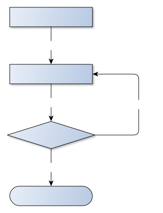

## the different shades of local kubernetes development


Note: test note

<!-- ========== ========== ========== -->

## Abstract
<blockquote style="font-size: .85em; text-align: justify;">
In a world for developer and **cloud native apps** we should not forget about our local **workflows** to keep the **developer** throuhput smooth and in a flow. Since **Kubernetes** gained a lot of traction and is currently right in the center of this debate we shall not miss to grasp a look at its local capabilities, workflows, flaws and it's quirks.
</blockquote>

<!-- ========== ========== ========== -->

``` shell
$ whoami

name: Tino Stöckel

where                   position
---------------------------------------------------------------
Turbine Kreuzberg GmbH  Platform Engineer
Circus Internet GmbH    Senior Developer / System Operator
Medici Living GmbH      Senior Developer

**skills**
- Kubernetes            - Ansible
- Docker                - JavaScript / Python / Go (working on)

... use -v for verbose

```

<!-- ========== ========== ========== -->

### Kubernetes at Turbine Kreuzberg


<!-- ========== ========== ========== -->

## Content
<!-- <ul>
    <li>
        
        <span>Kubernetes</span>
    </li>
    <li>(developer) workflow</li>
    <li>local development</li>
</ul> -->
<div style="display: flex; justify-content: space-between;">
    

    

    
</div>

Note:
- todo: use signs

<!-- ========== ========== ========== -->

## Kubernetes
## but why?

<!-- ========== ========== ========== -->

## Kubernetes
- infrastructure framework
- declarative
- desired state
- kubectl

<!-- ---------- ---------- ---------- -->

### I declare: Hello World!

``` yaml
apiVersion: apps/v1
kind: Deployment
metadata:
  name: nginx-deployment
spec:
  selector:
    matchLabels:
      app: nginx
  replicas: 2
  template:
    metadata:
      labels:
        app: nginx
    spec:
      containers:
      - name: nginx
        image: nginx:1.7.9
        ports:
        - containerPort: 80
```

<!-- ========== ========== ========== -->

## Workflow

<!-- ========== ========== ========== -->

### applications of Kubernetes
- **application development**
- **System Operations**
- **Kubernetes/Operator development**

Note:
- ... probably more
- lines are blurred

<!-- ========== ========== ========== -->

### what are you doing local?

<!-- ========== ========== ========== -->

### what are you doing local?
#### application development edition

- write some code
- have some sorts of local env
- check if your code works

Note: I assume

<!-- ========== ========== ========== -->

## minikube
- mainstream tool to run locally
- runs a single-node cluster
- runs in an vm

<!-- ========== ========== ========== -->

## demo time

<!-- ========== ========== ========== -->

### what are you doing local?
#### System Operations edition

- set up infrastructure
- provision infrastructure
- (opt) write some code
- check if it works

Note: I assume

<!-- ========== ========== ========== -->

## vagrant
- runs a single/multi-node cluster
- runs in vm's
- closest to real baremetal

<!-- ========== ========== ========== -->

## demo time

<!-- ========== ========== ========== -->

### what are you doing local?
#### Kubernetes Development edition

- (opt) set up infrastructure
- (opt) provision infrastructure
- (opt) check if it works
- write Kubernetes specific code
- check if your code works

Note: I assume

<!-- ========== ========== ========== -->

## kubeadm-dind-cluster
- runs a multi-node cluster
- runs in docker
- uses docker-in-docker

<!-- ========== ========== ========== -->

## demo time

<!-- ========== ========== ========== -->

## Tools

- minikube
- vagrant
- kubeadm-dind-cluster
- ... probably more

<!-- ========== ========== ========== -->

### Conclusion


<!-- ========== ========== ========== -->

# Thanks

playground:
- https://github.com/pandorasNox/local-kubernetes

slides:
- https://github.com/pandorasNox/presentations
- 04-local-kubernetes-development
